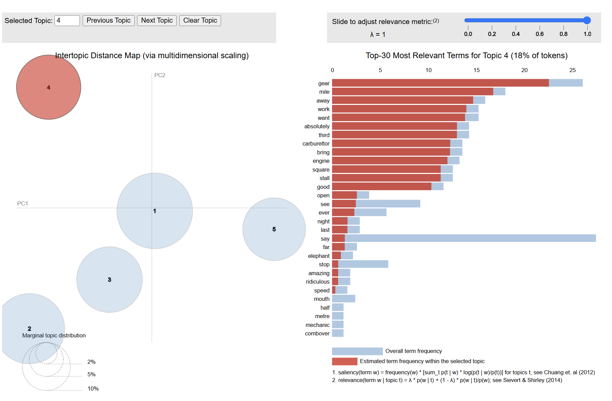
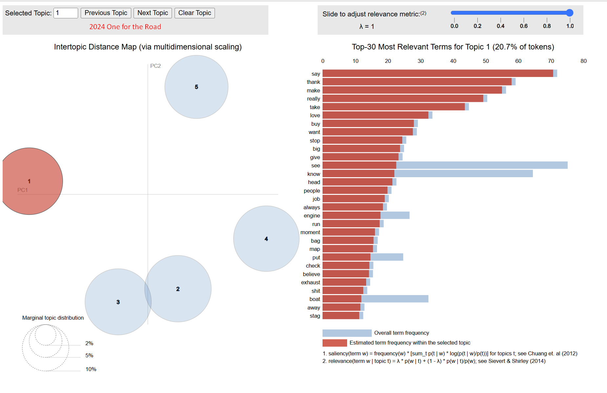

# TopGear

# Top Gear Africa -Topic Modelling & Visualization

## Context

Top Gear and subsequently, The Grand Tour, have been the cornerstone of my family's entertainment for the better part of 15 years. Its the one program that my wife and I can always agree on. No matter how many times we might have seen a particular episode, we still watch it and respond as if it was the first time seeing it.

I love the wildly different, but complimentary personalities; the banter, the chiding, and the apparent disdain (but actually deep appreciation) each of the presenters have for each other. My wife loves watching me brought to tears from laughing so hard... even on an episode I may have seen 10+ times. Top Gear is a part of our lives.

We were both deeply sad when it was time to call it a wrap. It was a perfect end to a perfect institution. Clarkson himself thought the same as he expected it to go down in a ball of flames (likely a result of his doing). But it didnt. Its end was sad, but wonderful. 

I wanted to take the opportunity to practice my fledgling data science skills against a topic that has some personal connection. 

## Purpose

The first Top Gear Special was in Botswana in 2007, and the final special saw the trio return to the same place 17 years later. I am interested to understand how the content of the presenters individual language shifted (or didnt?) between the two time periods.

The secondary purpose is simply to practice using a variety of generative models, pipelines, and visualization techniques with a real-world "problem"

The initial intention is to evaluate *each* presenter with:
- topic model
- UMAP to visualize the vectorized tokens (words)
- 'drift' analysis between 2007 and 2024
 
## Overall Approach

I was always taught "start with the Question". This project will be slightly different as I do not have a specific hypothesis to test. Such as "are the topics are more/less sentimental in the 2024 episode". This seems pretty pointless as I think the conclusion would be obvious.

Instead, the project will be approached by doing analysis, and then making inferences of the results.

## Technical Approach:

1. Obtain audio recording from the two episodes
2. Scope a proof of concept with 10min of the 2007 episode
3. Transcibe the audio file to text
4. Align the transcript to provide chunks and metadata
5. Diarize to assign speaker labels (ie who is saying each line)
6. Label speakers and split data into 3 data frames, one of each presenter
7. preprocess each data frame 
   1. remove special chars
   2. remove stop words (ex. "if", "as", "you")
   3. tokenize
   4. lemmatize (create the word 'root')
8. Topic Model using LDA (Latent Direlict Allocation)
   1. Coherence evaluation
   2. Optimization
9. Dynamic Topic Model
10. Visualize with UMAP 

## Results (work in progress)

2007 Botswana Episode:

[Botswana Special](outputs\combined_vis.html)

2024 One for the Road Episode: 

[One for the Road](outputs\vis_ALL_2024.html)

Conclusion / Insight:

... uhhh dunno. A lot of work, and not sure what this tells me lol. 
I suppose I'll that to the ToDo list! 

## Next - ToDO!

- [x] Diarize 2024 episode
- [X] Complete pyLDAvis for episodes 
- [ ] Create UMAP visuals
- [ ] Perform Dynamic Topic Model analysis
- [ ] Interpret LDA and draw insight

## Setup ⚙️
[GITHUB](https://github.com/m-bain/whisperX)

Tested for PyTorch 2.0, Python 3.10 (use other versions at your own risk!)
GPU execution requires the NVIDIA libraries cuBLAS 11.x and cuDNN 8.x to be installed on the system. Please refer to the CTranslate2 documentation.

1.  Create Python3.10 environment

`conda create --name whisperx python=3.10`

`conda activate whisperx`

2. Install PyTorch, e.g. for Linux and Windows CUDA11.8:
conda install pytorch==2.0.0 torchaudio==2.0.0 pytorch-cuda=11.8 -c pytorch -c nvidia

See other methods here.

3. Install this repo
pip install git+https://github.com/m-bain/whisperx.git

	If already installed, update package to most recent commit

`pip install git+https://github.com/m-bain/whisperx.git --upgrade`

If wishing to modify this package, clone and install in editable mode:

`$ git clone https://github.com/m-bain/whisperX.git
$ cd whisperX
$ pip install -e .`

You may also need to install ffmpeg, rust etc. Follow openAI instructions here https://github.com/openai/whisper#setup.

## Speaker Diarization
To enable Speaker Diarization, include your Hugging Face access token (read) that you can generate from Here after the --hf_token argument and accept the user agreement for the following models: Segmentation and Speaker-Diarization-3.1 (if you choose to use Speaker-Diarization 2.x, follow requirements here instead.)

Note
As of Oct 11, 2023, there is a known issue regarding slow performance with pyannote/Speaker-Diarization-3.0 in whisperX. It is due to dependency conflicts between faster-whisper and pyannote-audio 3.0.0. Please see this issue for more details and potential workarounds.